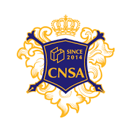
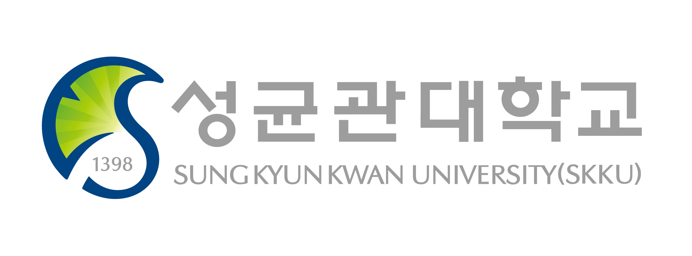

# ABOUT ME
## 🤷‍♂️Introduction
안녕하세요 제 이름은 김홍엽입니다. 현재 성균관대학교 소프트웨어학과 3학년 2학기에 재학중입니다.

좋아하는 음식은 피자 치킨 햄버거 떡볶이이며, 취미는 피아노, 기타, 오목입니다!

## 🏅Carrer
*   2022년 8월 대한민국 육군 병장 만기전역
*   2020년도 산학협력프로젝트, 하계 산학집중학습 프로그램 참여
*   2020년 소프트웨어대학 4대 학생회 솦속마을 지원국원

## 📗Educational Background
2012년 화성 반석초등학교 졸업

2015년 천안 두정중학교 졸업

2018년 충남삼성고등학교 졸업

2019년 성균관대학교 소프트웨어학과 입학

* * *

# SKILLS
## ©️ C/C++ : A
가장 익숙한 프로그래밍 언어입니다. PS를 할 때 대부분 c++를 사용하며, 개발 경험도 많습니다.

## 🦎Python : B
최근 들어 급속도로 친해진 언어입니다. 인공지능에 관심이 있기 때문에 앞으로도 많이 사용할 것 같습니다.

> 이 밖에도 전공 공부, Javascript 등 열심히 성장하고 있습니다.

* * *

# EDUCATION
## 💡 Where I studied ...
*   충남삼성고등학교 졸업 (2016 ~ 2018) 
  

 
*   성균관대학교 소프트웨어학과 재학 중 (2019 ~ ) 
{: width="50%" height="50%"} 

## 💡 What I learned ...
*   Programming Languages (Prof. Hwansoo Han)
*   Introduction to Database (Prof. Beomsuk Nam)
*   Introduction to Computer Architectures (Prof. Hyungmin Cho)
*   Algorithms (Prof. Daeho Cho)
*   Operating System (Prof. Youngik Um)

## 💡 What I am learning now ...
*   Open source Software Practice (Prof. Jinyoung Bak)
*   Fundamentals of Machine Learning (Prof. Jongwuk Lee)
*   Introduction to Computer Networks (Prof. Younghoon Kim)
*   Introduction to Artificial Intelligence (Prof. Youngjoong Ko)
*   Mobile App Programming Lab (Prof. Ikjun Yum)

